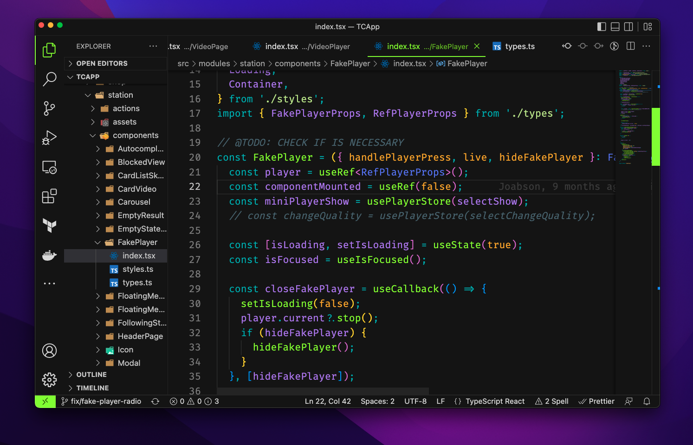

# TC Dark

Theme TC VSCode


## Install
```shell
    $ code --install-extension tc-dark-0.0.1.vsix
```

## Modifying
Change colors on [theme](themes/tc-dark-color-theme.json) and do:
```shell
    $ yarn generate
```

## Reference

[https://www.youtube.com/watch?v=QCqWzb-9Sy8](https://www.youtube.com/watch?v=QCqWzb-9Sy8)